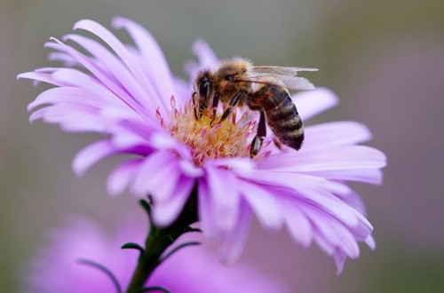
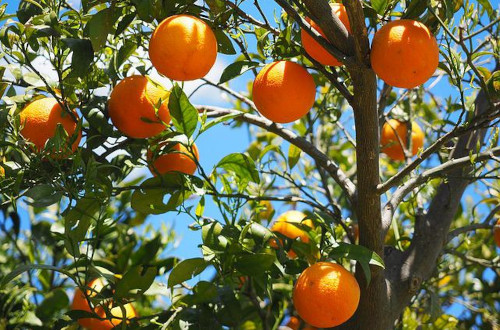
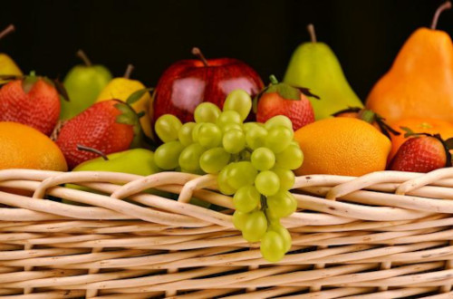

# Praktyka-inf03
https://www.kursinf.pl/pytania/inf03/wszystkie-pytania


obrazki.html

```
<!DOCTYPE html>
<html lang="pl">
    <head>
        <meta charset="UTF-8">
        <meta name="viewport" content="width=device-width, initial-scale=1.0">
        <title>Efekty obrazu</title>
        <link rel="stylesheet" href="styl.css">
    </head>
    <body>

        <header>
            <h2>Efekty na obrazach</h2>
        </header>

        <div id="blok1">
            <br>
            <label><input type="radio" name="efekt" value="blur" id="blur" name="blur"> Blur</label><br>
            <label><input type="radio" name="efekt" value="sepia" id="sepia" name="sepia"> Sepia</label><br>
            <label><input type="radio" name="efekt" value="negatyw" id="negatyw" name="negatyw"> Negatyw</label><br>
            <button onclick="zastosuj()">Zastosuj</button>
        </div>

        <div id="blok2">
            <br>
            <button onclick="kolorowy()">Kolorowy</button>
            <button onclick="czarnobialy()">Czarno-Biały</button>
        </div>

        <div id="blok3">
            <br>
            <input type="range" min="0" max="100" value="100" id="przezroczystosc" name="przezroczystosc"><br>
            <button onclick="przezroczystosc()">Zastosuj</button>
        </div>

        <div id="blok4">
            <br>
            <input type="range" min="0" max="250" id="jasnosc" name="jasnosc"><br>
            <button onclick="jasnosc()">Zastosuj</button>
        </div>

        <footer>
            <p><a href="http://www.css.com/" target="_blank">Zobacz inne efekty obrazu</a></p>
            <p>Stronę wykonał: <a href="https://ee-informatyk.pl/" target="_blank" style="color: unset;text-decoration: none;">EE-Informatyk.pl</a></p>
        </footer>

    </body>
    <script src="skrypt.js"></script>
</html>
```

style.css
```
* {
    font-family: 'Century', 'Serif';
    text-align: center;
}

header,footer {
    background-color: Indigo;
    color: white;
    font-style: italic;
    padding: 2px;
}

div {
    width: 50%;
    height: 470px;
    float: left;
}

img {
    padding: 3px;
    margin: 10px;
    border: 2px dashed SlateBlue;
}

a {
    color: white;
}

button {
    background-color: SlateBlue;
    color: white;
    border: none;
    padding: 10px 20px;
    margin-top: 10px;
}

button:hover {
    background-color: Indigo;
}

input[type="range"] {
    width: 80%;
}

footer {
    clear: both;
}

```


skrypt.js
```
function zastosuj() {
    const img = document.getElementById('pszczola');
    const blur = document.getElementById('blur').checked;
    const sepia = document.getElementById('sepia').checked;
    const negatyw = document.getElementById('negatyw').checked;
    
    let filterValue = '';

    if (blur) {
        filterValue += 'blur(6px) ';
    }
    if (sepia) {
        filterValue += 'sepia(100%) ';
    }
    if (negatyw) {
        filterValue += 'invert(100%) ';
    }

    img.style.filter = filterValue.trim();
}

function kolorowy() {
    const img = document.getElementById('owoce');
    img.style.filter = 'none';
}

function czarnobialy() {
    const img = document.getElementById('owoce');
    img.style.filter = 'grayscale(100%)';
}

function przezroczystosc() {
    const img = document.querySelector('#blok3 img');
    const przezroczystoscValue = document.getElementById('przezroczystosc').value;
    img.style.filter = `opacity(${przezroczystoscValue}%)`;
}

function jasnosc() {
    const img = document.querySelector('#blok4 img');
    const jasnoscValue = document.getElementById('jasnosc').value;
    img.style.filter = `brightness(${jasnoscValue}%)`;
}

```
https://www.praktycznyegzamin.pl/inf03ee09e14/praktyka/file/arkusze/2024/lato/inf_03_2024_06_12_SG_kolor.pdf

https://www.praktycznyegzamin.pl/inf03ee09e14/praktyka/file/arkusze/2025/lato/inf_03_2025_06_12_SG_kolor.pdf
